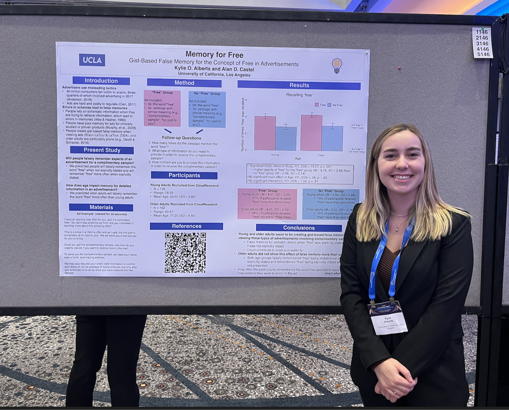

  <h1>About Me</h1>

# Kylie Alberts 

I am originally from the San Francisco Bay Area. I obtained my B.S. in Neuroscience at Union College, NY. At Union, I also minored in Data Analytics and German. I then obtained my M.A. in Psychology at UCLA. I am a current PhD Candidate at UCLA in Psychology where I study older adults' susceptibility to falling for scams and fraud. I recently interned at American AgCredit as their 2025 Data Science Intern. Upon graduation in March 2026, I hope to pursue a career in Data Science or UX Research so I can discover insights through data, code and conduct research everyday! In my free time, I love to explore National Parks, read books, and go to concerts. 

## Contact Me 

Email: kyliealberts14@gmail.com

