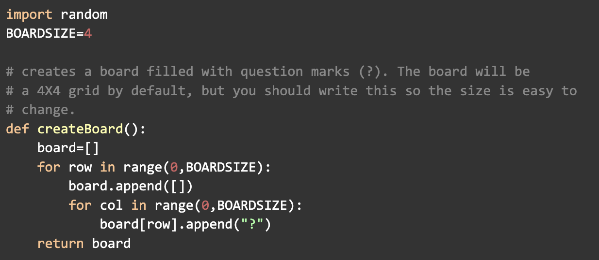
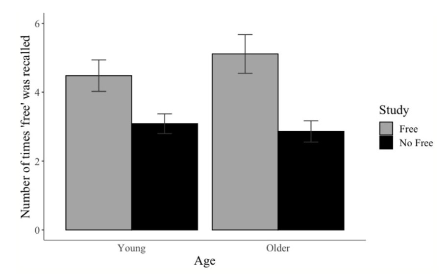

  <h1 style="text-align: center;">Code Examples</h1>

## California Wildfire Project R Code (click on image)

  

## Boggle Game Python Code (click on image)

  

## Memory for Free R Code (click on image)

