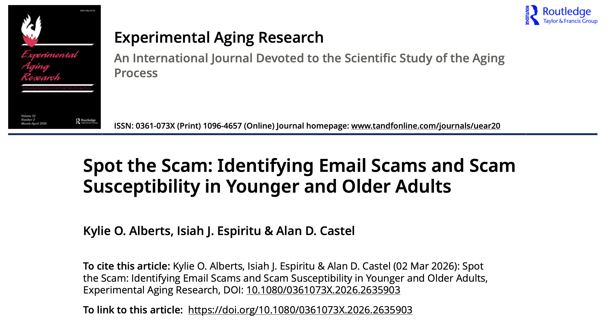
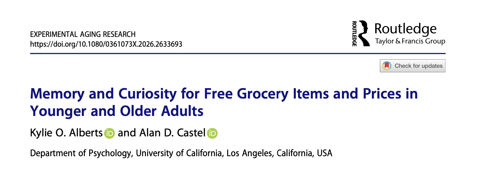
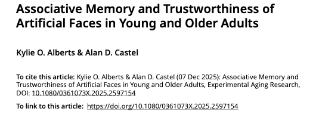
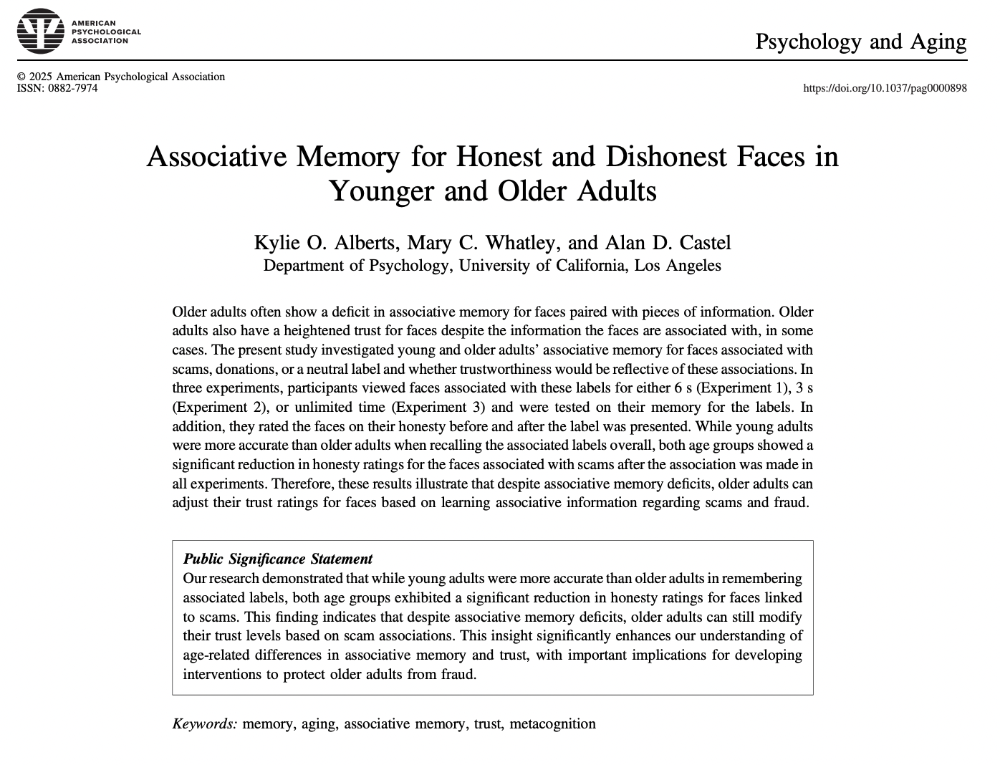
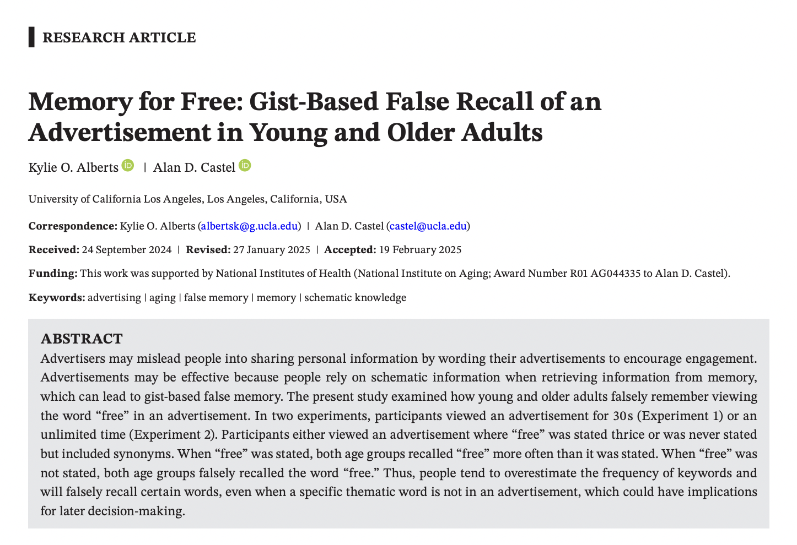
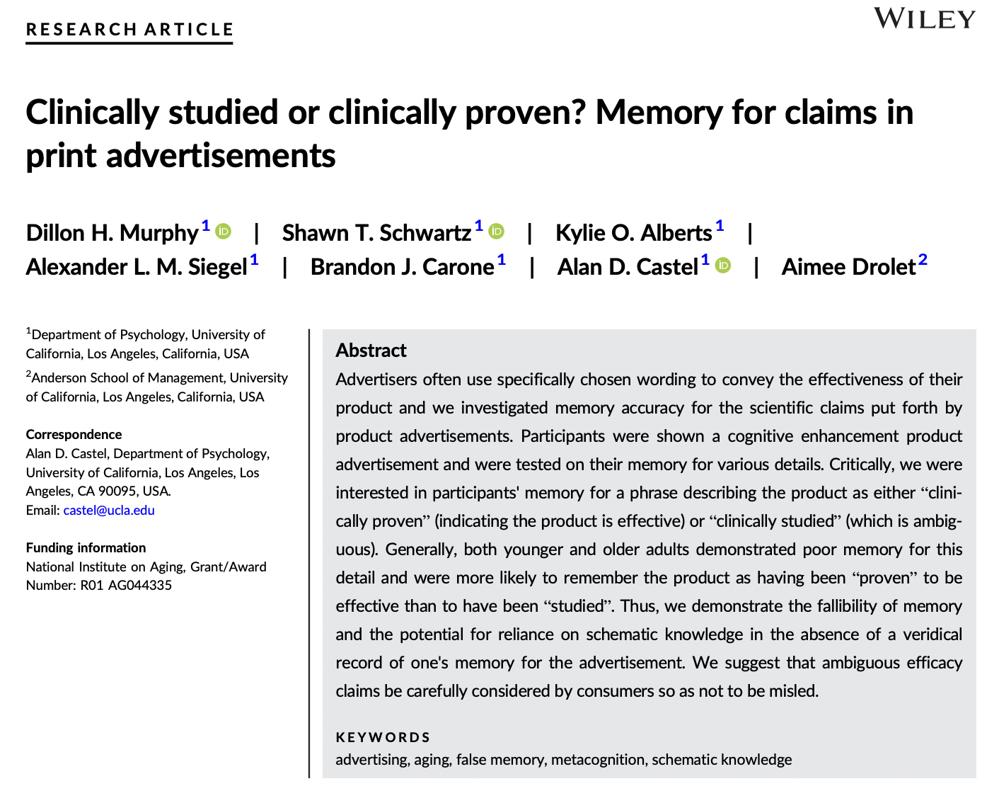

  <h1>Published Articles</h1>

 
 

## Spot the Scam: Identifying Email Scams and Scam Susceptibility in Younger and Older Adults

 

## Memory and Curiosity for Free Grocery Items and Price in Younger and Older Adults

 

## Associative Memory and Trustworthiness of Artificial Faces in Young and Older Adults

 

## Associative Memory of Honest and Dishonest Faces in Young and Older Adults

 

## Memory for Free: Gist-Based False Memory for Advertisements

 

## Clinically studied or Clinically Proven? Memory for claims in print advertisements

